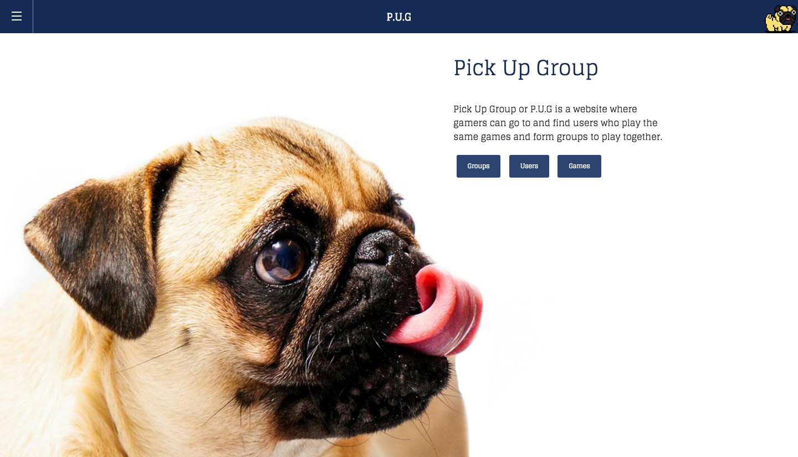

# P.U.G (Pick Up Group)

P.U.G is a website where gamers can go to and find users who play the same games and form groups to play together.

## Planning
To plan this project I used Trello to track what tasks I was working on and what I needed to do next. I Balsamiq to wireframe how I wanted to structure my website."

#### Trello

## Pain Points
One of the biggest struggles for me was filtering when to display the add to Group button on the games index page. It had to check if the current user is an Admin in a group and that said group doesn't already have that game.

## Technologies used

* Ruby on Rails
* Devise
* Carrierwave
* RMagick
* Foundation Framework
* Ransack
* acts\_as\_comentable
* Parallax.js
* jQuery
