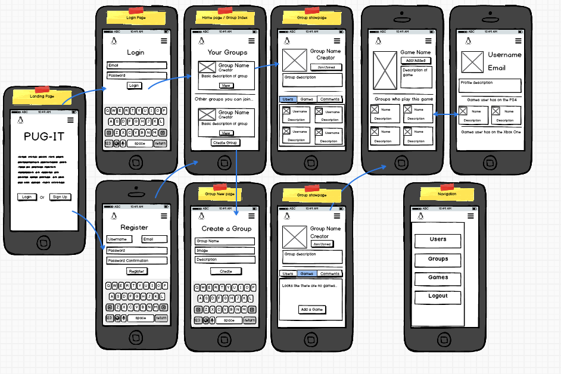

# P.U.G (Pick Up Group)

P.U.G is a website where gamers can go to and find users who play the same games and form groups to play together.

Try it for yourself [P.U.G](https://pickupgroup.herokuapp.com/)

## Requirements
This project had to:

* Be made using Ruby on Rails
* Have at least 3 models
* Have a secure login system

## Planning

### Trello

Trello was used to keep track of what tasks I was working on and what I needed to do next. I found this useful because I am usually someone who jumps around tasks when I should finish one and move onto the next, so this taught me some restraint.

### Balsamiq

Balsamiq was used to wireframe, plan how I wanted to structure my website and which key features I wanted. I found wireframing useful as designing for mobile first you have limited space, so you have to choose the most important features to put on first.

## Pain Points
One of the biggest struggles for me was filtering when to display the add to Group button on the games index page. It had to check if the current user is an Admin in a group and that said group doesn't already have that game.

## Technologies used

* Ruby
* Ruby on Rails
* Devise
* Carrierwave
* RMagick
* Foundation Framework
* Ransack
* acts\_as\_comentable
* Parallax.js
* jQuery
* PostgreSQL
